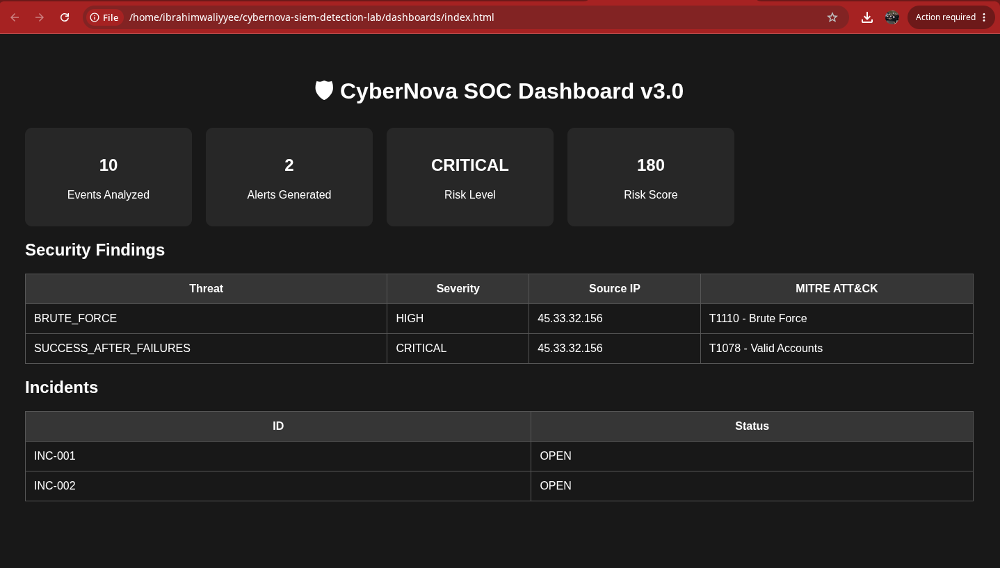
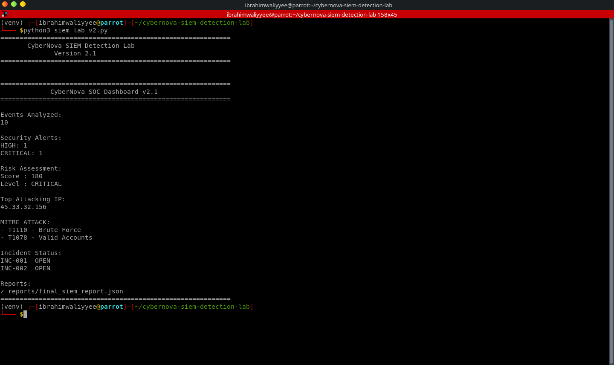

# 🛡️ CyberNova SIEM Detection Lab




## 📌 Project Overview

CyberNova SIEM Detection Lab is a Python-based Security Operations Center (SOC) simulation platform designed to analyze authentication logs, detect suspicious activities, generate security alerts, create incidents, calculate risk scores, and produce security reports.

This project demonstrates core Blue Team and SOC Analyst workflows including:

- Log analysis
- Threat detection
- Alert generation
- Incident response
- Risk assessment
- MITRE ATT&CK mapping
- Security reporting


---

# 🚀 Features

## 🔍 Log Analysis

The system processes authentication logs and identifies:

- Failed login attempts
- Successful logins
- Suspicious authentication patterns


## 🚨 Detection Engine

Currently detects:

### Brute Force Attack

MITRE ATT&CK:


T1110 - Brute Force


Example:


5 failed login attempts from the same IP address


### Successful Login After Failures

MITRE ATT&CK:


T1078 - Valid Accounts


Example:


Multiple failed attempts followed by successful authentication


---

# 📊 SOC Dashboard

The dashboard provides:

- Events analyzed
- Security alerts
- Risk level
- Attacking IP addresses
- MITRE ATT&CK techniques
- Incident status

## Dashboard Preview


## Detection Alerts




---

# ⚙️ Installation

Clone the repository:

```bash
git clone https://github.com/ibrahim-mukhtar-saidu/cybernova-siem-detection-lab.git

Enter the directory:

cd cybernova-siem-detection-lab

Create virtual environment:

python3 -m venv venv

Activate environment:

Linux:

source venv/bin/activate

Install dependencies:

pip install -r requirements.txt
▶️ Usage

Run the SIEM lab:

python3 siem_lab_v2.py

Example output:

CyberNova SIEM Detection Lab
Version 2.1

Events Analyzed:
10

Security Alerts:
HIGH: 1
CRITICAL: 1

Risk Assessment:
Score: 180
Level: CRITICAL

Top Attacking IP:
45.33.32.156
📁 Project Structure
cybernova-siem-detection-lab/

├── config/
│   └── siem_config.yaml

├── engine/
│   ├── detection_engine.py
│   ├── log_parser.py
│   ├── risk_engine.py
│   ├── alert_manager.py
│   └── incident_manager.py

├── dashboards/
│   ├── index.html
│   └── style.css

├── logs/
│   └── authentication.log

├── reports/

├── rules/
│   ├── brute_force.yaml
│   └── success_after_failures.yaml

└── siem_lab_v2.py

# 🎯 SOC Analyst Portfolio Project

This project simulates a real-world Blue Team Security Operations Center (SOC) workflow and demonstrates practical cybersecurity skills.

## Skills Demonstrated

✅ Security monitoring  
✅ Authentication log investigation  
✅ Detection engineering  
✅ Incident management  
✅ Risk scoring  
✅ MITRE ATT&CK mapping  
✅ Python security automation  
✅ SOC alert triage  
✅ Threat detection rule development  
✅ Blue Team operations  

## Technologies Used

- Python
- Linux
- YAML configuration
- HTML/CSS dashboard
- MITRE ATT&CK Framework
- Git & GitHub

This project was built as part of my cybersecurity learning journey and demonstrates hands-on experience with SOC workflows, threat detection, and security automation.

---

# 🔮 Future Improvements

Planned improvements:

- Real-time log monitoring
- Web-based SOC dashboard
- Database integration
- More MITRE ATT&CK detections
- Machine learning anomaly detection
- Email/Telegram alert notifications

👨‍💻 Author

Ibrahim Mukhtar Saidu

Cybersecurity Analyst | Founder of CYBERNOVA AI

GitHub:
https://github.com/ibrahim-mukhtar-saidu

⭐ If you find this project useful, consider giving it a star.
