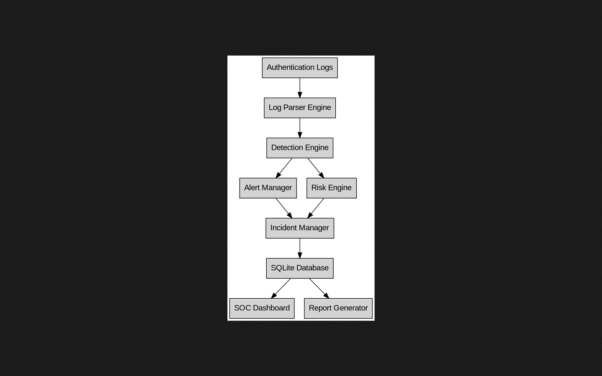

# 🛡️ CyberNova SIEM Detection Lab

A Python-based Security Operations Center (SOC) detection laboratory for analyzing synthetic authentication logs, detecting suspicious authentication activity, generating security alerts and incidents, calculating risk, mapping detections to MITRE ATT&CK, and producing analyst-facing reports and dashboards.


---

## 📌 Overview

**CyberNova SIEM Detection Lab** is a local, file-based SIEM simulation designed to demonstrate practical SOC and Blue Team detection-engineering workflows.

The pipeline processes **synthetic authentication events**, normalizes and validates them, applies configurable detection rules, generates security alerts and incidents, calculates cumulative risk, maps detections to MITRE ATT&CK techniques, and produces JSON and HTML analyst artifacts.

The project is intentionally designed as a **security-training and portfolio laboratory**, not as a production enterprise SIEM.

### Core Workflow

```text
Synthetic Authentication Logs
            │
            ▼
       Log Parser
            │
            ▼
     Detection Engine
            │
            ▼
       Alert Manager
            │
            ▼
      Incident Manager
            │
            ▼
        Risk Engine
            │
            ▼
   Report Generator
            │
            ▼
      SOC Dashboard
```

---

# 🚨 Detection Capabilities

## 1. Brute Force Detection

Detects repeated failed authentication attempts from the same source IP within a configurable time window.

### Default Rule

| Parameter    | Value               |
| ------------ | ------------------- |
| Rule ID      | `RULE-001`          |
| Threshold    | 5 failed attempts   |
| Window       | 10 minutes          |
| Severity     | HIGH                |
| MITRE ATT&CK | T1110 — Brute Force |
| Event Type   | `FAILED_LOGIN`      |

Rule definition:

```yaml
name: Brute Force Detection
id: RULE-001
description: Detect repeated failed login attempts from a single IP address.
severity: HIGH
mitre: T1110 - Brute Force
threshold: 5
window_minutes: 10
event_type: FAILED_LOGIN
```

The rule is stored in:

```text
rules/brute_force.yaml
```

---

## 2. Successful Login After Multiple Failures

Detects a successful authentication event following multiple failed authentication attempts from the same source IP within the configured detection window.

### Default Rule

| Parameter     | Value                  |
| ------------- | ---------------------- |
| Rule ID       | `RULE-002`             |
| Threshold     | 3 failures             |
| Window        | 10 minutes             |
| Severity      | CRITICAL               |
| MITRE ATT&CK  | T1078 — Valid Accounts |
| Failed Event  | `FAILED_LOGIN`         |
| Success Event | `SUCCESSFUL_LOGIN`     |

Rule definition:

```yaml
name: Successful Login After Multiple Failures
id: RULE-002
description: Detect a successful login after repeated failed login attempts.
severity: CRITICAL
mitre: T1078 - Valid Accounts
threshold: 3
window_minutes: 10
failed_event: FAILED_LOGIN
success_event: SUCCESSFUL_LOGIN
```

The rule is stored in:

```text
rules/success_after_failures.yaml
```

### Detection Caveat

This detection is intended as a **laboratory correlation example**.

A successful login following several failed attempts is **not automatically proof of account compromise**. In a production SOC, analysts should correlate additional telemetry such as endpoint activity, authentication context, geographic information, device information, and other available security signals.

---

# ⚙️ Configuration

Detection behavior is controlled through YAML configuration files.

### Detection Rules

```text
rules/
├── brute_force.yaml
└── success_after_failures.yaml
```

### Project Configuration

```text
config/
└── siem_config.yaml
```

The project configuration contains risk-level thresholds:

```yaml
project:
  name: CyberNova SIEM Detection Lab
  version: 2.1

risk:
  levels:
    LOW: 20
    MEDIUM: 50
    HIGH: 80
    CRITICAL: 100
```

The configuration loader provides:

* YAML parsing
* Configuration validation
* Required-field validation
* UTF-8 handling
* Missing-file detection
* Invalid-YAML detection
* Explicit configuration errors

Detection thresholds, severity levels, time windows, and MITRE ATT&CK mappings can therefore be adjusted without changing the core detection implementation.

---

# 🏗️ Architecture

The project uses a modular detection pipeline.

```text
┌─────────────────────────────┐
│ authentication.log          │
│ Synthetic Authentication    │
│ Events                      │
└──────────────┬──────────────┘
               │
               ▼
┌─────────────────────────────┐
│ Log Parser                  │
│                             │
│ • Parse events              │
│ • Validate timestamps       │
│ • Validate event types      │
│ • Validate IP addresses     │
│ • Normalize events          │
└──────────────┬──────────────┘
               │
               ▼
┌─────────────────────────────┐
│ Detection Engine            │
│                             │
│ • Brute-force detection     │
│ • Authentication correlation│
│ • Time-window evaluation    │
│ • YAML-driven rules         │
└──────────────┬──────────────┘
               │
               ▼
┌─────────────────────────────┐
│ Alert Manager               │
│                             │
│ • Alert IDs                 │
│ • Alert timestamps          │
│ • Alert normalization       │
└──────────────┬──────────────┘
               │
               ▼
┌─────────────────────────────┐
│ Incident Manager            │
│                             │
│ • Incident creation         │
│ • Persistent numbering      │
│ • JSON incident records     │
└──────────────┬──────────────┘
               │
               ▼
┌─────────────────────────────┐
│ Risk Engine                 │
│                             │
│ • Severity scoring          │
│ • Risk-level calculation    │
└──────────────┬──────────────┘
               │
               ▼
┌─────────────────────────────┐
│ Report Generator            │
│                             │
│ • SIEM JSON report          │
│ • Analyst summary           │
└──────────────┬──────────────┘
               │
               ▼
┌─────────────────────────────┐
│ SOC Dashboard               │
│                             │
│ • Alerts                    │
│ • Risk                      │
│ • MITRE mappings            │
│ • Incidents                 │
└─────────────────────────────┘
```

Architecture source:

```text
docs/architecture.dot
```

---

# 🔐 Security Engineering

The project was hardened following a security and engineering audit.

The implementation includes:

### Input Validation

* Authentication event validation
* Event-type validation
* Timestamp validation
* Username validation
* IPv4 validation
* IPv6 validation
* Malformed-line handling

IP addresses are validated using Python's standard-library `ipaddress` module.

### File Security

* Explicit UTF-8 encoding
* File existence checks
* Directory/file type validation
* Explicit permission errors
* Controlled output paths
* Context managers for file operations

### Configuration Security

YAML files are parsed using:

```python
yaml.safe_load()
```

rather than unsafe YAML loading mechanisms.

### Dashboard Security

Report values are HTML-escaped before being inserted into the generated dashboard.

This prevents untrusted log-derived values from being interpreted as HTML or executable browser content.

### Alert Security

Alert identifiers use UUIDs rather than timestamps alone, preventing collisions when multiple alerts are created within the same second.

### Incident Persistence

Incident identifiers use persistent sequence numbering so repeated pipeline executions do not overwrite earlier incident files.

### Time Handling

Generated timestamps use timezone-aware UTC timestamps.

### Code Quality

Production code is checked using:

* Ruff
* Pytest
* Coverage
* Bandit
* MyPy
* pip-audit
* Python compilation checks

---

# 📊 SOC Dashboard

The project includes a static HTML SOC dashboard generated from the final SIEM report.

The dashboard provides visibility into:

* Events analyzed
* Alerts generated
* Risk level
* Risk score
* Threat types
* Source IP addresses
* MITRE ATT&CK mappings
* Incident IDs
* Incident status

Dashboard generator:

```text
dashboards/dashboard_generator.py
```

Generated dashboard:

```text
dashboards/index.html
```

Preview:


---

# 🧪 Synthetic Authentication Data

The project includes a synthetic authentication dataset:

```text
logs/authentication.log
```

Example:

```text
2026-08-07 19:40:01 FAILED_LOGIN user=admin ip=45.33.32.156
2026-08-07 19:40:15 FAILED_LOGIN user=admin ip=45.33.32.156
2026-08-07 19:40:29 FAILED_LOGIN user=admin ip=45.33.32.156
2026-08-07 19:40:44 FAILED_LOGIN user=admin ip=45.33.32.156
2026-08-07 19:41:02 FAILED_LOGIN user=admin ip=45.33.32.156
2026-08-07 19:41:20 SUCCESSFUL_LOGIN user=admin ip=45.33.32.156
```

The dataset is intentionally synthetic and exists for:

* Security training
* Detection-engineering demonstrations
* Automated testing
* SOC workflow demonstrations
* Portfolio presentation

It is **not production telemetry** and must not be interpreted as evidence from a real organization or security incident.

---

# 🔄 Detection Workflow

A typical execution follows this process:

### 1. Ingestion

The pipeline reads:

```text
logs/authentication.log
```

### 2. Parsing

Each valid authentication event is converted into a normalized `AuthEvent` structure containing:

* Timestamp
* Event type
* Username
* Source IP
* Original line number

### 3. Validation

Malformed events are rejected safely and logged without terminating the entire parsing process.

### 4. Detection

The detection engine loads YAML rules and evaluates authentication activity against:

* Thresholds
* Time windows
* Event types
* Source IP correlation

### 5. Alert Creation

Detected events are converted into normalized alerts with:

* UUID-based alert IDs
* UTC timestamps
* Detection details

### 6. Incident Creation

Alerts are converted into persistent incident records.

### 7. Risk Assessment

Alert severities contribute to the cumulative risk score.

### 8. Reporting

The system generates a final JSON SIEM report.

### 9. Dashboard Generation

The report can be rendered into a static HTML SOC dashboard.

---

# 📄 Generated Artifacts

A normal execution can generate:

```text
reports/
└── final_siem_report.json

incidents/
├── incident_001.json
├── incident_002.json
└── ...

dashboards/
└── index.html
```

Runtime-generated JSON and incident artifacts are excluded from version control.

Static documentation and screenshots remain version-controlled where appropriate.

---

# ▶️ Installation

## Requirements

Recommended environment:

* Python 3.13
* Linux
* Git
* pip
* Virtual environment support

The application runtime currently requires:

```text
PyYAML >= 6.0, < 7.0
```

---

## Clone the Repository

```bash
git clone https://github.com/ibrahim-mukhtar-saidu/cybernova-siem-detection-lab.git
cd cybernova-siem-detection-lab
```

---

## Create a Virtual Environment

```bash
python3 -m venv venv
```

---

## Activate the Virtual Environment

Linux:

```bash
source venv/bin/activate
```

---

## Install Runtime Dependencies

```bash
python -m pip install -r requirements.txt
```

---

# ▶️ Running the SIEM

Run the canonical pipeline:

```bash
python3 siem_lab_v2.py
```

The pipeline performs:

```text
Authentication Log
        ↓
Parsing
        ↓
Detection
        ↓
Alerts
        ↓
Incidents
        ↓
Risk Assessment
        ↓
Final Report
```

The terminal output provides an analyst-oriented summary including:

* Number of events analyzed
* Security alert counts
* Severity distribution
* Risk score
* Risk level
* Top attacking IP
* MITRE ATT&CK techniques
* Incident status
* Report location

---

# 🔄 Compatibility Entry Point

The repository also provides:

```bash
python3 siem_lab.py
```

`siem_lab.py` is a deprecated compatibility wrapper.

It delegates execution to:

```text
siem_lab_v2.py
```

This preserves compatibility with older invocations while maintaining a single canonical detection implementation.

---

# 📊 Generate the SOC Dashboard

After running the SIEM pipeline:

```bash
python3 dashboards/dashboard_generator.py
```

The dashboard will be written to:

```text
dashboards/index.html
```

The generator reads:

```text
reports/final_siem_report.json
```

and safely escapes report-derived values before rendering them into HTML.

---

# 🧪 Testing

The project contains a comprehensive automated test suite covering the major application components.

Test areas include:

* Configuration loading
* YAML validation
* Authentication log parsing
* Invalid log handling
* IP validation
* Detection rules
* Detection time windows
* Alert generation
* Alert identifiers
* Incident creation
* Incident persistence
* Risk calculation
* Report generation
* Dashboard generation
* HTML escaping
* Logging configuration
* Main SIEM pipeline
* Compatibility entry point

Run the full test suite:

```bash
python -m pytest -q
```

Current result:

```text
119 passed
```

---

# 📈 Test Coverage

Run:

```bash
python -m pytest --cov=. --cov-report=term-missing
```

Current meaningful project coverage:

```text
98%
```

The remaining uncovered paths are primarily defensive error-handling branches and module entry-point guards.

The project does not artificially inflate coverage simply to achieve a higher percentage.

---

# 🛡️ Security Validation

The hardened repository has been checked with multiple security and engineering tools.

## Ruff

Command:

```bash
ruff check .
```

Result:

```text
All checks passed!
```

---

## Pytest

Command:

```bash
python -m pytest -q
```

Result:

```text
119 passed
```

---

## Coverage

Command:

```bash
python -m pytest --cov=. --cov-report=term-missing
```

Result:

```text
98%
```

---

## Bandit

Command:

```bash
bandit -r . -x ./tests,./venv,./.git
```

Result:

```text
High:   0
Medium: 0
Low:    0
```

No security issues were identified by the configured Bandit scan.

---

## MyPy

Command:

```bash
mypy config_loader.py engine dashboards siem_lab.py siem_lab_v2.py
```

Result:

```text
Success: no issues found in 12 source files
```

---

## pip-audit

Command:

```bash
pip-audit -r requirements.txt
```

Result:

```text
No known vulnerabilities found
```

---

## Python Compilation

Production modules successfully pass:

```bash
python -m compileall -q \
config_loader.py \
engine \
dashboards \
siem_lab.py \
siem_lab_v2.py
```

---

# 📁 Project Structure

```text
cybernova-siem-detection-lab/
│
├── config/
│   └── siem_config.yaml
│
├── dashboards/
│   ├── dashboard_generator.py
│   ├── index.html
│   └── style.css
│
├── docs/
│   ├── architecture.dot
│   └── architecture.png
│
├── engine/
│   ├── __init__.py
│   ├── alert_manager.py
│   ├── detection_engine.py
│   ├── incident_manager.py
│   ├── log_parser.py
│   ├── logging_config.py
│   ├── report_generator.py
│   └── risk_engine.py
│
├── logs/
│   └── authentication.log
│
├── reports/
│
├── rules/
│   ├── brute_force.yaml
│   └── success_after_failures.yaml
│
├── screenshots/
│   ├── architecture-diagram.png
│   ├── brute_force_detection.png
│   ├── dashboard-preview.png
│   ├── detection-alerts.png
│   ├── siem-terminal-report.png
│   └── soc-dashboard.png
│
├── tests/
│   ├── conftest.py
│   ├── test_alert_manager.py
│   ├── test_config_loader.py
│   ├── test_dashboard_generator.py
│   ├── test_detection_engine.py
│   ├── test_incident_manager.py
│   ├── test_log_parser.py
│   ├── test_logging_config.py
│   ├── test_report_generator.py
│   ├── test_risk_engine.py
│   ├── test_siem_lab.py
│   └── test_siem_lab_v2.py
│
├── config_loader.py
├── requirements.txt
├── siem_lab.py
├── siem_lab_v2.py
├── CHANGELOG.md
├── CONTRIBUTING.md
├── LICENSE
└── README.md
```

---

# 📸 Detection Evidence

## SOC Dashboard


## Brute Force Detection


## Detection Alerts


## Terminal Report


## Architecture



---

# 🎯 SOC Analyst Skills Demonstrated

This project demonstrates practical experience with:

### SOC Operations

* Authentication monitoring
* Security event analysis
* Alert triage concepts
* Incident creation
* Risk assessment
* Security reporting

### Detection Engineering

* Threshold-based detection
* Time-window correlation
* Authentication event correlation
* YAML-driven detection rules
* Detection severity
* MITRE ATT&CK mapping
* Detection limitations analysis

### Python Security Engineering

* Secure input parsing
* Data validation
* Defensive programming
* File handling
* Error handling
* UTC-aware timestamps
* HTML output sanitization
* Secure YAML parsing
* Modular architecture
* Type hints

### Software Quality

* Automated testing
* Code coverage
* Static analysis
* Security scanning
* Type checking
* Dependency vulnerability auditing
* Regression testing

---

# 🧠 Detection Engineering Considerations

The current detections demonstrate useful security concepts while intentionally exposing realistic detection limitations.

## Brute Force

The current brute-force rule correlates failed authentication attempts by source IP within a configured time window.

This is useful for identifying concentrated repeated failures but does not independently detect:

* Distributed password spraying
* Source-IP rotation
* Low-and-slow authentication attacks
* Credential stuffing across many accounts

These scenarios would require additional correlation strategies and telemetry.

---

## Successful Login After Failures

The second rule detects a successful login following multiple failures from the same source IP.

This can be a useful investigation signal, but it should not automatically be classified as confirmed compromise.

A production SOC would normally correlate additional evidence before escalating the event.

---

# ⚠️ Scope and Limitations

This project intentionally operates as a **local cybersecurity training laboratory**.

It does not provide:

* Network log ingestion
* Real-time event streaming
* Cloud integrations
* Enterprise SIEM integrations
* Production authentication telemetry
* Distributed storage
* Multi-user access control
* Endpoint telemetry collection
* Windows Event Log ingestion
* Linux journald/syslog ingestion
* External threat-intelligence feeds
* Automated firewall blocking
* Automated credential resets
* Automated account disabling
* Automated incident-response actions
* Production-scale data processing

These limitations are intentional.

The project focuses specifically on demonstrating:

```text
Detection Engineering
        +
SOC Workflow
        +
Defensive Python
        +
Security Testing
```

It should therefore **not be represented as a production enterprise SIEM**.

---

# 🔒 Security and Data Handling Notice

The repository contains synthetic security data.

Do not add:

* Real passwords
* Authentication credentials
* API keys
* Access tokens
* Private keys
* Production authentication logs
* Personally identifiable information
* Confidential company telemetry
* Other sensitive security data

to the repository.

When adapting this project for real-world environments, implement appropriate:

* Access controls
* Secrets management
* Data retention policies
* Log protection
* Privacy controls
* Authentication and authorization
* Secure storage
* Monitoring and auditing

---

# 📚 MITRE ATT&CK

The current laboratory detections reference the following MITRE ATT&CK techniques:

| Technique | Name           | Project Usage                                |
| --------- | -------------- | -------------------------------------------- |
| T1110     | Brute Force    | Repeated authentication failures             |
| T1078     | Valid Accounts | Successful login following repeated failures |

These mappings provide analyst-oriented context for the simulated authentication detections.

They are intended for educational and detection-engineering purposes.

---

# 🔬 Engineering Design Principles

The project follows several engineering principles:

### Single Responsibility

Major pipeline responsibilities are separated into dedicated modules:

```text
Parser
Detection
Alerting
Incident Management
Risk
Reporting
Dashboard
```

### Explicit Failure Handling

Expected operational failures are handled explicitly rather than silently ignored.

### Secure-by-Default Parsing

Authentication data is validated before entering the detection pipeline.

### Configuration-Driven Detection

Detection parameters are stored in YAML rules rather than being hardcoded into the detection engine.

### Testability

Detection logic is separated from filesystem and reporting concerns where practical.

### Minimal Dependencies

The runtime application intentionally uses a small dependency footprint.

---

# 📜 Version

Current project version:

```text
2.1
```

The repository's current architecture and documentation are aligned around the v2.1 modular pipeline.

---

# 📋 Project Status

Current verification status:

```text
Tests:              119 passed
Coverage:           98%
Ruff:               PASS
Bandit:             0 issues
MyPy:               PASS
pip-audit:          No known vulnerabilities
Compilation:        PASS
```

The project is suitable as a **portfolio demonstration of SOC detection engineering and defensive Python development**.

---

# 🤝 Contributing

Contributions are welcome when they improve the project's detection-engineering, security, reliability, testing, or documentation quality.

Please review:

```text
CONTRIBUTING.md
```

before submitting changes.

All changes should preserve the project's focused scope and avoid introducing unsupported enterprise functionality.

---

# 📜 License

This project is licensed under the MIT License.

See:

```text
LICENSE
```

for the complete license text.

---

# 👨‍💻 Author

**Ibrahim Mukhtar Saidu**

Cybersecurity Analyst & Security Researcher

GitHub:

```text
ibrahim-mukhtar-saidu
```

---

# ⭐ Project Purpose

CyberNova SIEM Detection Lab is part of a cybersecurity portfolio focused on demonstrating practical security engineering through hands-on projects.

The project demonstrates how raw authentication events can be transformed into structured security detections and SOC-oriented artifacts:

```text
Raw Authentication Events
          ↓
       Parsing
          ↓
      Validation
          ↓
      Detection
          ↓
       Alerts
          ↓
      Incidents
          ↓
   Risk Assessment
          ↓
       Reporting
          ↓
    Analyst Review
```

The objective is to demonstrate practical understanding of:

**SOC operations, detection engineering, defensive Python development, security validation, incident workflows, and analyst-oriented reporting.**
